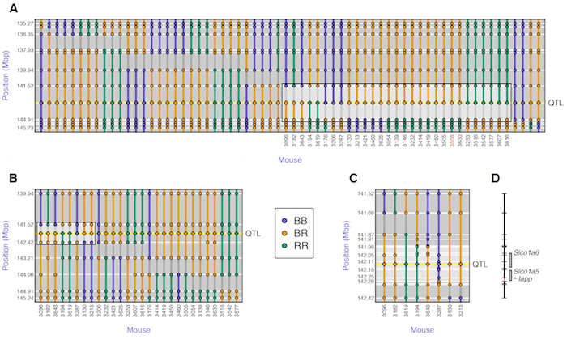

  

      <ul class="nav">
          <li><a href="samplemixups_fig7.html">prev</a></li>
          <li><a href="rqtlbook.html">next</a></li>
      </ul>
  

Tian J et al. (2015)
Identification of _Slco1a6_ as a candidate gene that broadly
affects gene expression in mouse pancreatic islets.
[bioRxiv](http://biorxiv.org/content/early/2015/06/16/020974),
[doi: 10.1101/020974](http://dx.doi.org/10.1101/020974)

**Figure 4**. &mdash; Fine-mapping of the islet chromosome 6
eQTL. **A**: initial SNP genotypes of the 52 mice with
recombination events in the 10 Mbp region around the QTL, along with
their inferred QTL genotypes (shown at the center of the inferred
interval). The highlighted box indicates 29 mice with recombination
events flanking the QTL. **B**: Additional genotypes on five
markers in the QTL interval, for 28 of the 29 mice with recombination
event flanking the QTL. The highlighted box indicates eight mice with
recombination event flanking the QTL. **C**: Additional genotypes
in the QTL interval, for eight mice with recombination events flanking
the QTL. The QTL interval is reduced to 298 kbp (141.979 &ndash; 142.277
Mbp), a region containing three genes (**D**).
