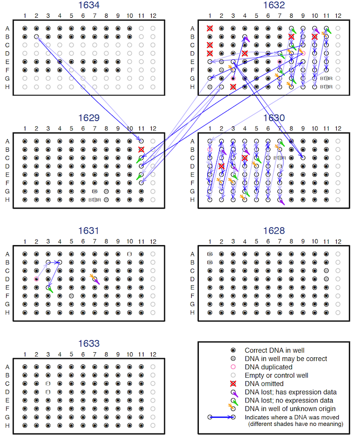

Broman KW, et al. (2014)
Identification and correction of sample mix-ups in expression
genetic data: A case study. arXiv:1402.2633
\[[Abstract](http://arxiv.org/abs/1402.2633) | [pdf (2.8M)](http://arxiv.org/pdf/1402.2633v1.pdf)\]

**Figure 7**. &mdash; The DNA sample mix-ups on the seven 96-well plates used
for genotyping. Black dots indicate that the correct DNA was put in
the well. Blue arrows point from where a sample should have been
placed to where it was actually placed; the different shades of blue
convey no meaning. Red X&rsquo;s indicate DNA samples that were omitted.
Orange arrowheads indicate wells with incorrect samples, but the
sample placed there is of unknown origin. Purple and green
arrow-heads indicate cases where the sample placed in the well was
incorrect, but the DNA that was supposed to be there was not found;
with the purple cases, there was corresponding gene expression data,
while for the green cases, there was no corresponding gene
expression data. Pink circles (e.g., well D02 on plate 1631)
indicate sample duplicates. Gray dots indicate that the sample
placed in the well cannot be verified, as there was no corresponding
gene expression data. Gray circles indicate controls or unused
wells.
